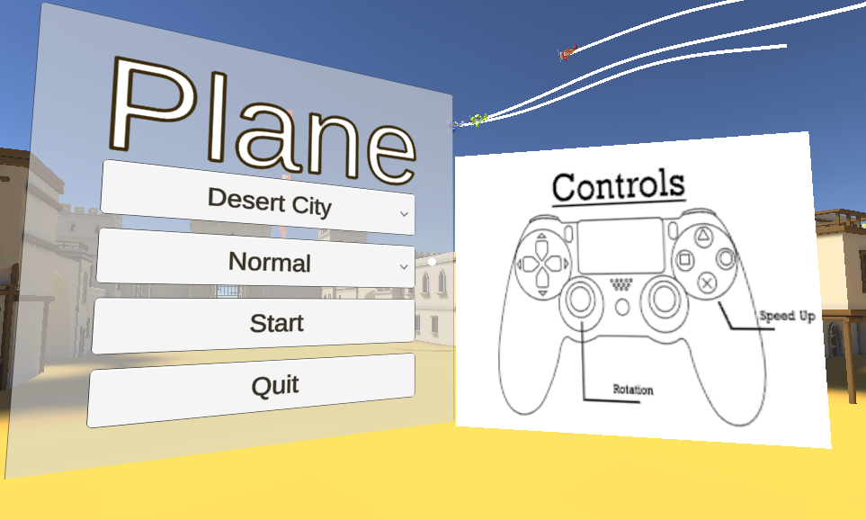
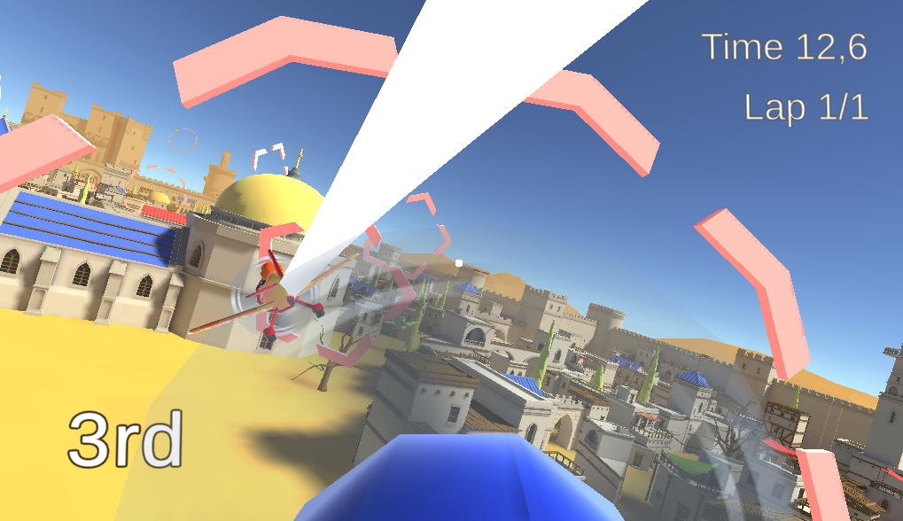
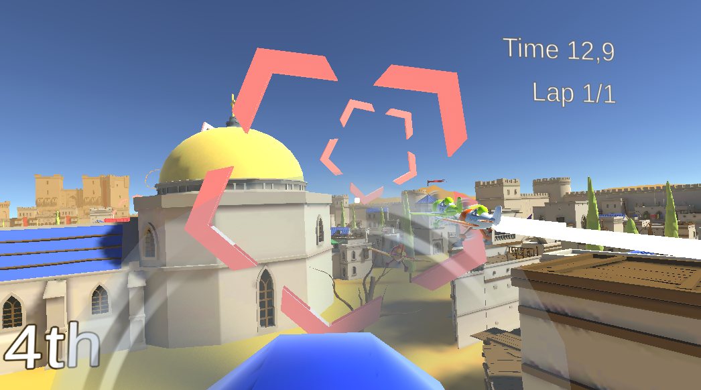
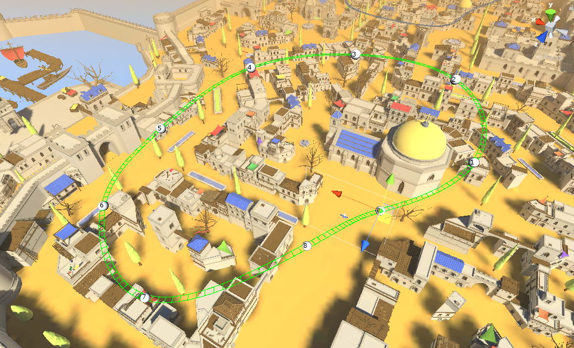

# Plane
Proyecto para **Interfaces Inteligentes**. Universidad de La Laguna.

## Guía de uso

**Menú del juego**:
* Elegir mapa
* Dificultad de la IA
* Controles

Tras darle a **Start**, el jugador aparecerá en el mapa seleccionado y podrá empezar a explorar y competir con el resto de aviones.

## Hitos de programación

1. Físicas de movimiento
2. Implementar los agentes
3. Lógica de la carrera
    1. Checkpoints
    2. Colisiones
    3. Final de carrera
4. Lógica del juego
    1. Menu principal
    2. Pause
5. Google VR
    1. Integrar GVR en el proyecto
    2. Adaptar paneles VR friendly
6. Testeo y Debugging

## Tecnologías

Principalmente, hemos utilizado técnicas de **Aprendizaje por Refuerzo** para programar la IA de los aviones rivales con los que compite el jugador. La idea era conseguir programar una IA lo suficientemente buena para poder competir, y que además se moviera de forma más "natural", tal y como lo haría un jugador humano. Además, ha sido un buen ejercicio para adquirir un conocimiento inicial en el campo del **Machine Learning**.

Por tanto, nos hemos valido de la librería de [Unity ML-Agents](https://unity3d.com/machine-learning/) para ello.

Hemos replicado todo el proceso de entrenamiento: Definir los sensores de los agentes (los aviones), sus reglas de recompensa, y finalmente entrenarlos desde cero en alguno de los circuitos creados hasta que aprendían a volar perfectamente.

Esta parte ha sido bastante extensa y se ha presentado como proyecto para otra asignatura de la carrera (Sistemas Inteligentes). En [estas diapositivas](https://docs.google.com/presentation/d/1Fdk0-GMTNlRGTxtGA2b4uJ2YyxJdg4rt-31qGQZ7Ly8/edit?usp=sharing) hablamos mucho más en detalle de la librearía y de todo el proceso que hemos seguido.

Algo a destacar y con relevancia para el juego es, por ejemplo, como hemos creado los **niveles de dificulad** en el juego: Básicamente, cuanto más tiempo dejes a un agente entrenarse, mejor será a la hora de competir (Aprende mejor a como manejar el avión y a ser más rápido). Por tanto, para la dificultad **dificil** utilizamos las redes neuronales que habíamos entrenado durante más tiempo (4 horas). Para la dificultad **normal**, cortamos el entrenamiento de la red neuronal a los **40 minutos**

## Imágenes

## Reparto de tareas

Para el reparto de tareas hemos ido avanzando en el proyecto en base al tiempo libre de cada uno, e intentando participar todos por igual dejando trabajo para la persona que no hubiera podido participar tanto como los demás.

## Autores

* David Afonso Dorta
* Miguel Bravo Arvelo
* Christian Ramos Barrera
